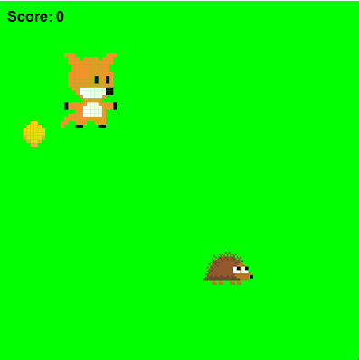

#  Coin Collector

A simple, arcade-style game made with [Python](https://www.python.org/) and [Pygame Zero](https://pygame-zero.readthedocs.io/en/stable/). Collect coins while avoiding the hedgehog — how high can you score before time runs out?




---

##  Game Overview

- Move the fox using the arrow keys
- Collect coins for points
- The hedgehog competes with you to collect them
- Game ends after 30 seconds

---

##  How to Run

###  Option 1: Run From Source (Python Required)

####  Requirements
- Python 3.7+
- Pygame Zero

####  Setup

```bash
git clone https://github.com/your-username/coin-collector.git
cd coin-collector
pip install pgzero
```

####  Run the Game

```bash
pgzrun main.py
```

> If `pgzrun` is not recognized, make sure your Python Scripts folder is in your system PATH.

---

###  Option 2: Windows Executable (No Python Needed)

You can download a standalone `.exe`:

1. Go to the [Releases](https://github.com/your-username/coin-collector/releases) tab
2. Download the latest `CoinCollector.exe`
3. Double-click to play!

---

##  Project Structure

```
Coin-Collector/
├── main.py                   # Game logic
├── images/                   # Game sprites
│   ├── fox.png
│   ├── coin.png
│   └── hedgehog.png
├── pgz_data/                 # Icon file
│   └── icon.png
├── README.md
└── .gitignore
```

---

##  Packaging With PyInstaller (For Developers)

If you want to build your own `.exe`:

```bash
pyinstaller --onefile --windowed ^
  --add-data "pgz_data/icon.png;pgzero/data" ^
  --add-data "images/fox.png;images" ^
  --add-data "images/coin.png;images" ^
  --add-data "images/hedgehog.png;images" ^
  main.py
```

> The `pgzero/data` path is necessary because Pygame Zero tries to load a default icon from there.

---


##  Credits

Created by John McGinnes

---

##  License

MIT License — feel free to use, modify, and share.
```
